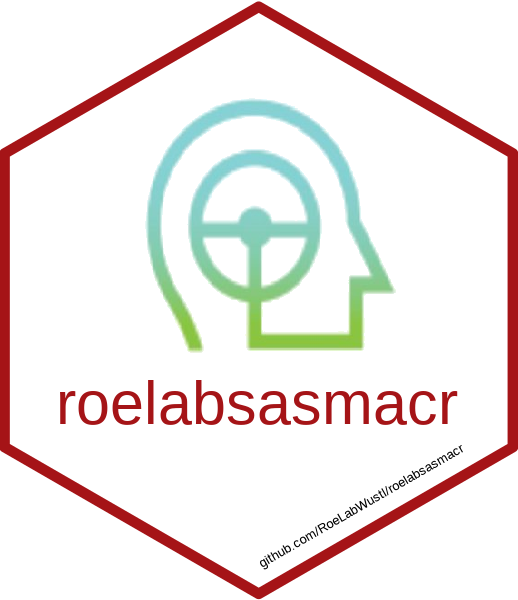

<!-- README.md is generated from README.Rmd. Please edit that file -->

# roelabsas 

<!-- badges: start -->

[](https://github.com/RoeLabWustl/roelabsas)
[](https://github.com/RoeLabWustl/roelabsas/commits/master)
<!-- badges: end -->

## Overview

The goal of `roelabsas` is to provide helpful SAS Macros for the [Roe
Lab at Washington University in Saint Louis](https://roelab.wustl.edu/).

<br />

## Installation

Individual macros can be loaded in SAS with something like:

``` sas
filename m url "https://raw.githubusercontent.com/RoeLabWustl/roelabsas/main/sasmacr/correlation_heatmap.sas";
%include m;
```

<br />

## About

### Washington University in Saint Louis 

Established in 1853, [Washington University in Saint
Louis](https://www.wustl.edu) is among the world’s leaders in teaching,
research, patient care, and service to society. Bosting 24 Nobel
laureates to date, the University is ranked 7th in the world for most
cited researchers, received the 4th highest amount of NIH medical
research grants among medical schools in 2019, and was tied for 1st in
the United States for genetics and genomics in 2018. The University is
committed to learning and exploration, discovery and impact, and
intellectual passions and challenging the unknown.
